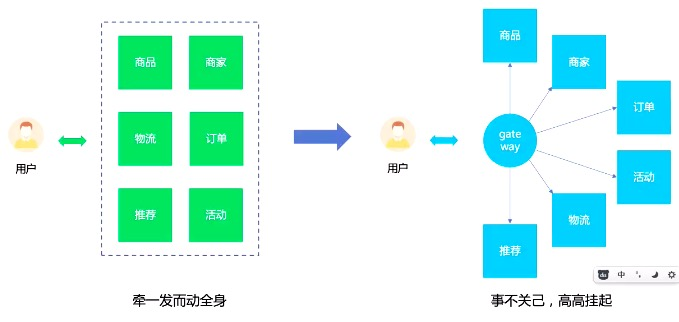

# 微前端
[[toc]]
## 即拆功能，拆模块，
- 如果单纯用组件去堆，可能会出现问题。
- 增加一个新功能成本最低，高内聚低耦合，更好地应对变化
- 其他人也想用
- 其他人的部件添加进来
- 项目技术栈迁移

## 借鉴后端微服务的思想，拷贝到前端，先拆后合。后端微服务的思想在前端的映射

- 前端各个模块给出一个个接口，给输入输出即可，不关心内部

- 优点
  - 隔离
  - 弹性/扩展性
  - 增强稳定性
  - 降低成本

- 网盘思路
  - 参照windows系统，需要什么功能就安装什么功能

  # 微前端
- singleSpa && qiankun
## js沙箱
- 1、主要就是隔离js变量
- 2、实现原理
  - 创建一个库
  - 1、初始化快照,保存一份window自带的属性(初始化的时候就处理)
  - 2、在window上增加删除属性,用window和快照进行对比,将变化的的数据保存起来,下次对象激活的时候赋到window上
  - 3、用快照还原window最初的属性
```js
class SnapshotSandBOX{
    constructor(){
      this.proxy = window
      this.modifyData={}
      this.active()
    } 
    active(){
      this.snapshotData={}
      for(let i in window){
        if(window.hasOwnProperty(i)){
          this.snapshotData[i] = window[i]
        }
      }
      for(let i in this.modifyData){
        if(this.modifyData.hasOwnProperty(i)){
          window[i] = this.modifyData[i]
        }
      }
    } 
    inactive(){
      for(let i in window){
        if(window.hasOwnProperty(i)){
          if(window[i] !== this.snapshotData[i]){
            this.modifyData[i] = window[i];
            window[i]=  this.snapshotData[i] 
          }
        }
      }
    }      
  }

let sandbox = new SnapshotSandBOX();

// 沙箱:应用的运行 从开始到街上,切换后不会影响全局
((window)=>{
  window.a = 1
  window.b = 2
  console.log(window.a,window.b)
  sandbox.inactive();
  console.log(window.a,window.b)
  sandbox.active()
  console.log(window.a,window.b)
})(sandbox.proxy)// sandbox.proxy 就是window
```
- 多个沙箱 利用proxy
```js
// 代理沙箱阔以实现应用沙箱,把不同的应用用不同的代理来处理
class ProxySandbox{
  constructor (){
    const rawWindow = window
    const fakeWindow = {}
    const proxy = new Proxy(fakeWindow,{
      set(target,p,value){
        target[p] = value;
        console.log('===>',target,p,value)
        return true
      },
      get(target,p){
        return target[p] || rawWindow[p]
      }
    })
    this.proxy = proxy
  }
}
let sandbox1 = new ProxySandbox();
let sandbox2 = new ProxySandbox();
((window)=>{
  window.a = 'hello';
  console.log(window.a)
})(sandbox1.proxy);

((window)=>{
  window.a = 'world';
  console.log(window.a)
})(sandbox2.proxy)
```
## css 隔离(Shadow DOM)
- 通过给元素添加`dom.attachShadow({mode:'closed'})`,他里面的dom和css 与外面隔绝的
```html
<!DOCTYPE html>
<html lang="en">
<body>
  <div>
    <p>hello world</p>
    <div id="shadow"></div>
  </div>
  <script>
    // css 隔离 shadow
    let shadowDOM = shadow.attachShadow({mode:'closed'});
    let pElm = document.createElement('p');
    pElm.innerHTML = 'hello zf';
    let styleElem = document.createElement('style')
    styleElem.textContent = `
      p{ color : red}
    `
    shadowDOM.appendChild(styleElem)
    shadowDOM.appendChild(pElm)
    // 缺点 挂载body上的属性 会有问题
  </script>
</body>
</html>
```
## singleSpa
### 主应用
- singleSpa 缺陷 
  - 不够灵活 不能动态加载js文件
  - 样式不隔离 没有js沙箱的机制
- 主应用 注册 `import {registerApplication,start} from 'single-spa'`
```js
import {registerApplication,start} from 'single-spa'
async function loadScript(url){
  return new Promise((res,rej)=>{
    let script = document.createElement('script')
    script.src = url;
    script.onload = res;
    script.onerror = rej;
    document.head.appendChild(script)
  })
}
//  singleSpa 缺陷 不够灵活 不能动态加载js文件
//  样式不隔离 没有js沙箱的机制
registerApplication('myuepp',async ()=>{
    await loadScript('http://localhost:10001/js/chunk-vendors.js');
    await loadScript('http://localhost:10001/js/app.js');
    return window.singleVue // bootStrap mount unmount
  },
  // 用户切换到/vue 的路径下,我需要加载刚才定义的子应用
  location => location.pathname.startsWith('/vue'),
  {}
)
start();
```
- app.vue
- `<div id="vue"></div>` 是子应用挂载的地方
```vue
<template>
  <div id="app">
      <router-link to="/">home</router-link> 
      ||
      <router-link to="/vue">vue</router-link> 
      <router-view></router-view>
    <div id="vue"></div>
  </div>
</template>
```
### 子应用
- vue.config.js 配置
```js
module.exports = {
  configureWebpack:{
    output:{
      library:'singleVue',
      libraryTarget:'umd'
    },
    devServer:{
      port:10000
    }
  }
}
```
- router
```js
// base 设置成 父应用 默认进入的路由
const router = new VueRouter({
  mode: 'history',
  base: '/vue',
  routes
})
```
- main.js
- 子应用通过singleSpaVue 包装后,往外面抛出`bootstrap,mount,unmount`三个方法
```js
import singleSpaVue from 'single-spa-vue'

Vue.config.productionTip = false

const appOptions={
  el:'#vue',// 挂载到父应用中的id为vue的标签中
  router,
  render(h) {
    return h(App)
  },
}

const vueLifeCycle =  singleSpaVue({
  Vue,
  appOptions
})
// 如果是父应用引用 子应用的路由以他为主(如果不设置 他会以主应用的路由进行跳转)
if(window.singleSpaNavigate){
  __webpack_public_path__ = 'http://localhost:10001/'
}else{
  delete appOptions.el;
  new Vue(appOptions).$mount('#app')
}

// 父应用会调用这些方法
export const bootstrap = vueLifeCycle.bootstrap
export const mount = vueLifeCycle.mount
export const unmount = vueLifeCycle.unmount
// 我们需要父应用加载子应用,将子应用打包成一个个lib库 给父应该使用
```

## qiankun
- 主应用(vue)
- registerMicroApps 用来注册子应用
### main.js
```js
import {registerMicroApps,start} from 'qiankun'
const apps = [
  {
    name:'vueApp',
    // 默认会加载这个html 解析里面的js 动态执行(子应用必须支持跨域)
    entry:'//localhost:10001',
    container:"#vue",
    activeRule:'/vue',
    props:{a:1}
  },
  {
    name:'reactApp',
    entry:'//localhost:20000',
    container:'#react',
    activeRule:'/react'
  }
]
registerMicroApps(apps)
start()
```
### App.vue
- `<router-view></router-view>` 主应用的路由切换
- `<div id="vue"></div>` 用来挂载 vue 子应用
- `<div id="react"></div>` 用来挂载 react 子应用
```vue
<template>
  <div >
    <el-menu :router='true' mode="horizontal">
      <!-- 基座中阔以放自己的路由 -->
      <el-menu-item index='/'>Home</el-menu-item>
      <el-menu-item index='/vue'>Vue应用</el-menu-item>
      <el-menu-item index='/react'>react应用</el-menu-item>
    </el-menu>
  <router-view></router-view>
    <!-- 引用其他子应用 -->
    <div id="vue"></div>
    <div id="react"></div>
    123
  </div>
</template>
```
### vue子应用
- 子应用要提供3个 对象`bootstrap,mount,unmount`给主应用调用
- `window.__POWERED_BY_QIANKUN__`用来判断是否是qiankun 调用的环境
- main.js
```js
let instance = null
function render(props){
  console.log('xxxxxxxxxxxx',props)
  instance = new Vue({
    router,
    render: function (h) { return h(App) }
  }).$mount('#app')// 这里是挂载到自己的html中  基座会拿到这个挂载的html 将其插入进去
}

if(!window.__POWERED_BY_QIANKUN__){
  // 默认独立运行
  render()
}

if (window.__POWERED_BY_QIANKUN__) {
  // eslint-disable-next-line no-undef
  // 如果是父应用引用 子应用的路由以他为主
  // 动态添加publicPath
  __webpack_public_path__ = window.__INJECTED_PUBLIC_PATH_BY_QIANKUN__
}

export async function bootstrap(props){};

export async function mount(props){
  render(props)
};

export async function unmount(props){
  instance.$destroy()
};
```
  


