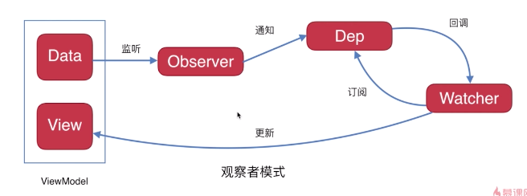

# vue source
<!-- - [handWrite](https://github.com/xiaoqi7777/vue) -->

[[TOC]]

## 初次渲染&&更新(MVVM)


### new vue操作
- Vue 本质是一个函数,在对象的原型上挂载了一堆方法
- 在new Vue的时候,将传入的参数进行初始化,(`this.$options=options`全部挂载到当前实例的$options上)
- 初始化的操作，分别处理data、computed、watch等(demo中只有这三)
- initData,vue内部的处理数据都放在this._data上,用户实际操作的data是通过`Object.defineProperty`把this._data映射到this.data上
```js
import Vue from 'vue';
let vm = new Vue({
  el:'#app',
  data(){
    return {msg:'hello zf'}
  },
  render(h){// 内部会调用此render方法 将render方法中的this 变成当前实例
    return h('p',{id:'a'},'hello',this.msg)
  }
})
```
```js
function initData(vm){
  // 将用户插入的数据 通过object.defineProperty重新定义
  let data = vm.$options.data
  data = vm._data = typeof data === 'function' ? data.call(vm):data||[]
  for(let key in data){
    // 会将对vm上的取值操作和赋值操作代理给vm._data 属性 因为vm._data里面的数据才是响应式的
    proxy(vm,'_data',key)
  }
  observe(vm._data);// 观察数据
}
```
### Observer 观察1
- 对数据(data里面的值)进行观察处理,遍历data内的每一个值。对每一个值,为他们创建一个`Dep`列表,(这个Dep就是观察者模式,他提供了订阅和通知的方法),都添加一个`get&&set`方法,`set`取值同时对dep进行通知,`get`取值对dep进行订阅(get操作是在获取值的时候处理的)
```js
export function defineReactive(data,key,value){// 定义响应式的数据变化
// 不支持ie8 及ie8 以下的浏览器
  // {school:{name:'xx'}} 监控的value下还可能有对象,需要深度观察 
  let childOb = observe(value)//递归观察
  let dep = new Dep();//dep 里面可以收集依赖 收集的是watcher

  Object.defineProperty(data,key,{
    get(){ // 只要对这个属性进行了取值操作,就会将当前的watcher存入进去
      if(Dep.target){ // 这次有值用的是渲染watcher
        // 我们希望存入的watcher 不能重复 如果重复会造成更新时多次渲染
        dep.depend();// 他让dep 中可以存watcher  我还虚妄让这个watcher中也存放dep,实现一个多对多的关系
        if(childOb){// 数组的依赖收集  
           childOb.dep.depend(); // 数组也收集了当前渲染 watcher
            dependArray(value);// 收集儿子的依赖
        }
      }
      return value;
    },
    set(newValue){
      if(newValue === value) return
      observe(newValue);//如果你设置的值是一个对象的话 应该在进行监控这个新增的对象
      value = newValue
      dep.notify()
    }
  })
}
```
### Watch 
- 前面初始赋值等操作完成后,就是`$mount`挂载数据,会创建一个 一个Watch(vm,渲染函数)
- Watch接收4个参数`(vm,exprOrFn,cb,opts)`,exprOrFn可能是一个表达式(在Computed和Watcher方法的时候传入的是表达式要去对应的data),也有可能是一个函数(渲染函数),在实例化`Watch`的时候会调用自身的get方法,get方法主要做了3件事
  - 1、在dep列表中 把当前的watch实例注入到Dep中`Dep.target`上
  - 2、执行传入的`exprOrFn`函数(`传入this.vm`),进行更新
  - 3、在dep列表中 把当前最近的watch删除,去最新的一个
```js
 /**
   * 
   * @param {*} vm 当前组件的实例 new Vue
   * @param {*} exprOrFn  用户可能传入的是一个表达式 也有可能传入的是一个函数
   * @param {*} cb  用户传入的回调函数 vm.$watch('msg',cb)
   * @param {*} opts 一些其他参数
   */
  // vm msg (newValue,oldValue)=>{} {user:true}
  // vm ()=>this.fullName+this.lastName ()=>{} lazy:true
  constructor(vm,exprOrFn,cb=()=>{},opts={}){
    this.vm = vm;
    this.exprOrFn = exprOrFn
    if(typeof exprOrFn === 'function'){
      this.getter = exprOrFn; // getter就是new Watcher传入的第二个函数
    }else{
      // 处理watch 获取到方法
      this.getter = function(){
        // 调用此方法 会将vm上对应的表达式取出来
        return util.getValue(vm,exprOrFn)
      }
    }
    if(opts.user){
      // 标识是用户自己写的watch
      this.user = true;
    }
    this.lazy = opts.lazy; // 为true 说明他是计算属性
    this.dirty = this.lazy;
    this.cb = cb
    this.deps = []
    this.depsId = new Set()
    this.opts = opts
    this.id = id++
    this.immediate = opts.immediate
    // 创建watcher的时候  先将表达式对应 值取出来(老值)
    // 如果当前我们是计算属性的话 不会默认调用get方法
    this.oldValue = this.lazy ? undefined : this.get();//默认创建一个watcher 会调用自身的get方法
    if(this.immediate){ // 如果有immediate 就直接运行用户定义的函数
      this.cb(this.oldValue)
    }
  }
```
### Observer 观察2
- 页面进行更新取值的时候,会触发`get`方法,此时调用dep的订阅,将Watch存到dep的列表中(`#这里就是Watch订阅#`)。同时将dep保存到当前的Watch中(此操作在watch时候用的到)
- 重新赋值的时候,会触发`set`方法,他会通知dep,遍历之前保存的`watcher`,调用watcher的update方法(`#Dep回调watch#`)
```js
class Dep{
  constructor(){
    this.id = id++;
    this.subs = [];
  }
  addSub(watcher){// 订阅 就是将调用addSub时传入的内容保存到数组中
    this.subs.push(watcher);
  }
  notify(){
    this.subs.forEach(watcher=>watcher.update())
  }
  depend(){
    if(Dep.target){
    // 为了防止直接调用depend方法 先判断一下
      // Dep.target是一個渲染watcher
      Dep.target.addDep(this)//希望可以在 watcher 中互相记忆
    }
  }
}

addDep(dep){
    // 同一个watcher 不应该重复记录dep
    let id = dep.id; // msg 的dep
    if(!this.depsId.has(id)){
      this.depsId.add(dep);
      this.deps.push(dep);// 就让watcher 记住了当前的dep
      dep.addSub(this);
    }
  }
```
### Watch(update&&批量更新)
- Watch 内部有一个update方法
- 每次调用update方法的时候,他会过滤相同的watch,将所有要更新的watch,保存起来
- 通过`nextTick`异步更新所有的watch,watch遍历的时候,重新执行exprOrFn更新视图(`#watch更新view#`),同时将cb回调执行(创建watch的时候传入的)将新老值传入
```js
update(){
    // 如果立即调用get 会导致页面刷新  需要异步来更新
    // vue的特点就是批量更新
    if(this.lazy){
      // 如果是计算属性值变化了 稍后取值时重新计算
      this.dirty = true 
    }else{
      queueWatcher(this)
     }
  }
  run(){
    let newValue = this.get();//新值
    if(this.oldValue !== newValue){
      this.cb(newValue,this.oldValue)
    }
  }
  let has = {}
  let queue = []
  function flushQueue(){
      queue.forEach(watcher => watcher.run())
      has = {} // 恢复正常 下一轮继续更新使用 
      queue = []
  }
  function queueWatcher(watcher){
    // 对重复的watcher过滤操作
    let id = watcher.id
    if(has[id] == null){
      has[id] = true
      queue.push(watcher);//相同的watcher 他只会存一个到queue中 
      // 延迟情况队列
      nextTick(flushQueue)
    }
  }
```
## nextTick
- 原理就是 浏览器 是否支持微任务 支持就用 不支持就用宏任务
```js
function nextTick(cb){
  callbacks.push(cb)
  // 要异步刷新这个callbacks 获取一个异步的方法
  // 异步是分执行顺序的 会先执行promise mutationObserver setImmediate setTimeout
  let timerFunc = ()=>{
    flushCallbacks();
  }
  if(Promise){
    Promise.resolve().then(timerFunc)
    return
  }
  // h5的api
  if(MutationObserver){
    let observe = new MutationObserver(timerFunc);
    let textNode = document.createTextNode(1)
    observe.observe(textNode,{characterData:true})
    textNode.textContent = 2
    return  
  }
  if(setImmediate){
    setImmediate(timerFunc)
    return
  }
  setTimeout(timerFunc,0)
}
```
## vue对象和数组劫持
### 对象的劫持
- 在data初始化的时候,所有的数据都会放到vm._data上,用户在访问this上的属性时候都是通过代理访问到vm._data。
- 内部在观察数据的时候是对vm._data,而不是用户定义的data
```js
function proxy(vm,source,key){
  // 代理数据 vm.msg = vm._data.msg
  Object.defineProperty(vm,key,{
    get(){
      return vm[source][key]
    },  
    set(newValue){
      vm[source][key] = newValue
    }
  })
}
function initData(vm){
  // 将用户插入的数据 通过object.defineProperty重新定义
  let data = vm.$options.data
  data = vm._data = typeof data === 'function' ? data.call(vm):data||[]
  for(let key in data){
    // 会将对vm上的取值操作和赋值操作代理给vm._data 属性 因为vm._data里面的数据才是响应式的
    proxy(vm,'_data',key)
  }
  observe(vm._data);// 观察数据
}
```
### 收集依赖
- 在observer(观察中)触发get取值的时候,进行依赖收集
- 使用Dep类来收集依赖，收集一个个watcher，需要更新时再把watcher全部执行
- 1、首先 递归观察data`observe(value)` 当他不是对象或者是null的时候就直接返回,否则就创建data对象
- 2、取值触发get的时候,如果`observe(value)`返回的是值存在,那么创建一个dep并且调用dep.depend收集当前的watch,`dependArray(value)`收数组集儿子的依赖
```js
  export function observe(data){
    if(typeof data !== 'object' || data === null){
      return // 不是对象或者是null 我就不用执行后续逻辑了
    }
    if(data.__ob__){// 已经被监控过了
      return data.__ob__
    }
    return new Observer(data)
  }

  export function defineReactive(data,key,value){// 定义响应式的数据变化
    // 不支持ie8 及ie8 以下的浏览器
    // {school:{name:'xx'}} 监控的value下还可能有对象,需要深度观察 
    let childOb = observe(value)//递归观察
    let dep = new Dep();//dep 里面可以收集依赖 收集的是watcher

    Object.defineProperty(data,key,{
      get(){ // 只要对这个属性进行了取值操作,就会将当前的watcher存入进去
        if(Dep.target){ // 这次有值用的是渲染watcher
          // 我们希望存入的watcher 不能重复 如果重复会造成更新时多次渲染
          dep.depend();// 他让dep 中可以存watcher  我还虚妄让这个watcher中也存放dep,实现一个多对多的关系
          if(childOb){// 数组的依赖收集  
            childOb.dep.depend(); // 数组也收集了当前渲染 watcher
              dependArray(value);// 收集儿子的依赖
          }
        }
        return value;
      },
      set(newValue){
        if(newValue === value) return
        observe(newValue);//如果你设置的值是一个对象的话 应该在进行监控这个新增的对象
        value = newValue
        dep.notify()
      }
    })
  }
  // 递归收集儿子依赖
  export function dependArray(value){// 递归收集数组中的依赖
    for(let i=0;i<value.length;i++){
      let currentItem = value[i];// 有可能也是一个数组
      currentItem.__ob__&&currentItem.__ob__.dep.depend();
      if(Array.isArray(currentItem)){
        dependArray(currentItem);// 不停的收集 数组中的依赖关系
      }
    }
  }
```
### 数组的劫持
- Object.defineProperty 的set方法无法观察到数组的变化,需要对原生的数组方法进行劫持
- 在观察data的时候 就需要对array进行单独处理,
  - 1、创建一个dep观察者模式
  - 2、给data定义'__ob__'变量 指向的是当前的this
  - 3、如果data是数组那么拦截数组的方法`data.__proto__ = arrayMethods`
  - 4、之前收集依赖的时候都往dep中注入了依赖所以array方式执行完成后 dep.notify 执行watch
  - 主要拦截用户调用 push shift unshift pop reverse sort splice 他们会改变原有数组
```js
class Observer{
  constructor(data){
    this.dep = new Dep();
    // 每个对象 包括数组都有一个__ob__ 属性 返回的是当前的observer实例 
    Object.defineProperty(data,'__ob__',{
      get:()=>this
    })
    if(Array.isArray(data)){
      // 重写push等方法
      // 只能拦截数组的方法 数组里的每一项 还需要去观测一下
      data.__proto__ = arrayMethods
      // 当调用数组的方法时 手动通知
      observerArrary(data)
    }else{
      this.walk(data)
    }
  }
}

// arrayMethods
let  oldArrayProtoMethods = Array.prototype;
export let arrayMethods = Object.create(oldArrayProtoMethods);
methods.forEach(method => {
  arrayMethods[method] = function(...args){
    // 函数劫持 切片编程
    let r = oldArrayProtoMethods[method].apply(this,args)
    let inserted;
    switch(method){
      case 'push':
        // xxxxxxxxxxxx
        break;
      case 'unshift':
        // xxxxxxxxxxxx
        inserted = args
        break;
      case 'splice':
        // xxxxxxxxxxxxxxxx
        inserted = args.slice(2)
        break;
      default:
        break;
    }
    if(inserted) {
      observerArrary(inserted)
    }
    // 数组方法操作的时候 通知视图更新 
    this.__ob__.dep.notify() 
    return r     
  }
})
```
## watch 原理
- watch用法 最终还是调用了`this.$watch`
- $watch 原理也是内部创建了一个`Watcher`参数上面有详细说明,将watch放入到dep列表中
- 在Watch中 如果`expr`是一个表达式 他会获取对应的函数,第三个参数`handler`,就是Watch更新完成后的回调,他会传入新老值,此逻辑和批量更新雷同
```js
// 遍历 watch 的属性调用vm.$watch
function createWatcher(vm,key,handler,opts){
  // 内部最终也会使用$watch方法
  return vm.$watch(key,handler,opts);
}
function initWatch(vm){
  let watch = vm.$options.watch;// 获取用户传入的watch属性
  for(let key in watch){ //msg:(){},msg:[(){},(){}] 可能是对象 可能是数组
    let userDef = watch[key];
    let handler = userDef
    if(userDef.handler){
      handler = userDef.handler
    }
    createWatcher(vm,key,handler,{immediate:userDef.immediate})
  }
}

Vue.prototype.$watch = function(expr,handler,opts){
  let vm = this;
  new Watcher(vm,expr,handler,{user:true,...opts});//用户自己定义的watch
}
run(){
  let newValue = this.get();//新值
  if(this.oldValue !== newValue){
    this.cb(newValue,this.oldValue)
  }
}
```
## Computed
- computed原理也是依赖`Watch`,遍历computed,对每个函数都创建一个Watcher,第一个参数是vm,第二个是要执行的computed单个函数,第三个没用,第四个是computed独有的标识`{lazy:true}`
- watcher默认会执行get,但是Computed创建的Watch不会默认执行get(get就是执行exprOrFn)
- computed同样用了代理,每次key访问的是代理的一个函数,返回的也是一个可以执行的函数
- 页面渲染的时候 会执行个函数
- Computed 初次渲染当`dirty`为true的时候`watcher.evaluate`，会调用watch里面的get方法,执行exprOrFn函数返回并且将`{dirty:false}`(已经取值过),显示在页面上
- Computed 更新渲染 在Watch.update中判断,如果`this.lazy`为true就修改`{dirty:true}`,表示可以取值,不会通知页面刷新
  - 第一次 执行`fullName`的时候 `firstName`和`lastName`取值的时候会在watch中保存他们deps
  - 在 Computed函数值 变化的时候,他会调用`watcher.depend`,获取之前保存的`firstName`和`lastName`deps,遍历执行他们的依赖,此时会将渲染watcher放入来dep列表中,当`firstName`或者`lastName`发生变化的时候 会先走自己的计算watcher在走渲染watcher进行更新
```js
//  Computed 以他为例
  computed:{
    fullName(){
      return this.firstName+this.lastName
    },
  }
function createComputedGetter(vm,key){
  let watcher = vm._watchersComputed[key];// 这个watcher 就是我们定义的计算属性watcher
  // 用户取值是会执行此方法
  return function(){
    if(watcher){
      // 初次渲染
      if(watcher.dirty){
        // 如果页面取值 而且dirty是true 就会去调用watcher的get方法
        watcher.evaluate()
      }
      // 更新渲染
      if(Dep.target){// watcher 就是计算属性的watcher dep = [firstName.dep,lastName.Dep]
        watcher.depend()
      }
      return watcher.value
    }
  }
}
depend(){
  let i = this.deps.length;
  while(i--){
    this.deps[i].depend();
  }
}
evaluate(){
  this.value = this.get();
  this.dirty = false; // dirty:false 表示值求过了
}
addDep(dep,a){
  // 同一个watcher 不应该重复记录dep
  let id = dep.id; // msg 的dep
  if(!this.depsId.has(id)){
    this.depsId.add(dep);
    this.deps.push(dep);// 就让watcher 记住了当前的dep
    dep.addSub(this);
  }
}
function initComputed(vm,computed){
  // 将计算属性的配置 放到vm上
  let watchers = vm._watchersComputed = Object.create(null);// 创建存储计算属性的watcher的对象
  for(let key in computed){// {fullName:()=>{this.firstName+lastName}}
    let userDef = computed[key]
    // new Watcher此时什么都不会做 配置了lazy dirt 
    watchers[key] = new Watcher(vm,userDef,()=>{},{lazy:true})// lazy 表示计算属性 watcher 默认刚开始这个方法不会执行
    // vm.fullName
    //将这个属性 定义到vm上
    Object.defineProperty(vm,key,{
      get:createComputedGetter(vm,key)
    })
  }
}
// 更新操作
 update(){
    // 更新的时候 如果lazy
    if(this.lazy){
      // 如果是计算属性值变化了 稍后取值时重新计算
      this.dirty = true 
    }else{
      queueWatcher(this)
     }
  }
```
## DOM
### 初次渲染
- h 是处理jsx语法(与react 的createElement一样) 处理好的参数交给`vnode`创建虚拟节点
- vnode也叫虚拟节点 就是一个对象保存了一堆属性,参数vnode(tag,props,key,children)
- createElm 创建真实节点,接收的参数就是vnode
  - updateProperties(vnode,oldProps={}) 就是 更新属性,当oldProps传入就是新老属性对比,只有vnode参数的时候就给属性赋值
  - 当child是对象的时候就,递归调用render进行渲染,当child是文本的时候 就直接创建文本节点,最后返回vnode.el,插入到页面中
```js
// 创建
let app = document.getElementById('app')
import {h,render,patch} from './vnode/index'
let oldVnode = h('div',{id:'container',style:{background:'red'}},
              h('li',{style:{background:'red'},key:'a'},'a'),
              h('li',{style:{background:'yellow'},key:'b'},'b'),
              h('li',{style:{background:'blue'},key:'c'},'c'),
              h('li',{style:{background:'pink'},key:'d'},'d'),
);
let container = document.getElementById('app')
render(oldVnode,container)
// h函数
export function h(tag,props,...children){
  let key = props.key;
  delete props.key;// 属性中不包括key属性
  children = children.map(child => {
    if(typeof child === 'object'){
      return child
    }else{
      return vnode(undefined,undefined,undefined,undefined,child)
    }
  })
  return vnode(tag,props,key,children)
}
// 虚拟节点
export function vnode(tag,props,key,children,text){
  return {
    tag,  // 表示当前标签名
    props,// 表示当前标签上的属性
    key,   // 唯一表示用户可能传递
    children,
    text
  }
}

// 创建真实节点
function createElm(vnode){
  let {tag,children,key,props,text} = vnode;
  if(typeof tag === 'string'){
      // 标签  一个虚拟节点 对应着他的真实节点  主要是做一个映射关系
      vnode.el = document.createElement(tag);
      updateProperties(vnode);
      children.forEach(child => { // child是虚拟节点
          return render(child,vnode.el); // 递归渲染当前孩子列表
      });
  }else{
      // 文本
      vnode.el = document.createTextNode(text);
  }
  return vnode.el
}
```
## DOM-diff
- 在更新的时候 会做DOM-diff比较
- `patch`方法就是核心的比较方法
### 比较新老元素(同级的情况)
  - 1、当标签不一样的时候直接替换
  - 2、当只有文本的的时候 不一样就直接替换
  - 3、标签一样属性不一样 直接比较新老属性值
```js
export function patch(oldVnode,newVnode){
  // 1) 先比对 标签一样不一样 
  if(oldVnode.tag !== newVnode.tag){ // 以前是div 现在是p标签
      // 必须拿到当前元素的父亲 才能替换掉自己
      oldVnode.el.parentNode.replaceChild(createElm(newVnode),oldVnode.el)
  }
  // 2) 比较文本了 标签一样 可能都是undefined
  if(!oldVnode.tag){
      if(oldVnode.text !== newVnode.text){ // 如果内容不一致直接根据当前新的元素中的内容来替换到文本节点
          oldVnode.el.textContent = newVnode.text;
      }
  }
  // 标签一样 可能属性不一样了
  let el = newVnode.el =  oldVnode.el; // 标签一样复用即可
  updateProperties(newVnode,oldVnode.props); // 做属性的比对

  // 必须要有一个根节点
  // 比较孩子 
  let oldChildren = oldVnode.children || [];
  let newChildren = newVnode.children || [];

  // 老的有孩子 新的有孩子 updateChildren
  if(oldChildren.length > 0 && newChildren.length > 0){
      updateChildren(el,oldChildren,newChildren); // 不停的递归比较
  }else if(oldChildren.length > 0){  // 老的有孩子 新的没孩子 
      el.innerHTML = ''
  }else if(newChildren.length > 0){ // 老的没孩子 新的有孩子
      for(let i = 0; i < newChildren.length ;i++){
          let child = newChildren[i];
          el.appendChild(createElm(child)); // 将当前新的儿子 丢到老的节点中即可
      }
  }
  return el;
}
function isSameVnode(oldVnode,newVnode){
  // 如果两个人的标签和key 一样我认为是同一个节点 虚拟节点一样我就可以复用真实节点了
  return (oldVnode.tag === newVnode.tag) && (oldVnode.key === newVnode.key)
}
// 比较儿子
function updateChildren(parent,oldChildren,newChildren){
  // vue增加了很多优化策略 因为在浏览器中操作dom最常见的方法是 开头或者结尾插入
  // 涉及到正序和倒序
  let oldStartIndex = 0; // 老的索引开始
  let oldStartVnode = oldChildren[0]; // 老的节点开始
  let oldEndIndex = oldChildren.length - 1;
  let oldEndVnode = oldChildren[oldEndIndex];


  let newStartIndex = 0; // 新的索引开始
  let newStartVnode = newChildren[0]; // 新的节点开始
  let newEndIndex = newChildren.length - 1;
  let newEndVnode = newChildren[newEndIndex];

  function makeIndexByKey(children){
      let map = {};
      children.forEach((item,index)=>{
          map[item.key] = index
      });
      return map; // {a:0,b:1...}
  }
  let map = makeIndexByKey(oldChildren);
  while(oldStartIndex<=oldEndIndex && newStartIndex <= newEndIndex){
      // 向后插入元素
      if(!oldStartVnode){
          oldStartVnode = oldChildren[++oldStartIndex];
      }else if(!oldEndVnode){
          oldEndVnode = oldChildren[--oldEndIndex]
      }else  if(isSameVnode(oldStartVnode,newStartVnode)){  // 先开前面是否一样
          patch(oldStartVnode,newStartVnode);// 用新的属性来更新老的属性,而且还要递归比较儿子
          oldStartVnode = oldChildren[++oldStartIndex];
          newStartVnode = newChildren[++newStartIndex]
      // 当前向前插入
      }else if(isSameVnode(oldEndVnode,newEndVnode)){ // 从后面比较看是否一样
          patch(oldEndVnode,newEndVnode); // 比较孩子 
          oldEndVnode = oldChildren[--oldEndIndex];
          newEndVnode = newChildren[--newEndIndex];
      // 倒叙功能 abcd  dcba
      }else if(isSameVnode(oldStartVnode,newEndVnode)){
          patch(oldStartVnode,newEndVnode);
          parent.insertBefore(oldStartVnode.el,oldEndVnode.el.nextSibling);
          oldStartVnode = oldChildren[++oldStartIndex];
          newEndVnode = newChildren[--newEndIndex]
          // 这个是比对将尾部插入到了前面
      }else if(isSameVnode(oldEndVnode,newStartVnode)){
          patch(oldEndVnode,newStartVnode);
          parent.insertBefore(oldEndVnode.el,oldStartVnode.el);
          oldEndVnode = oldChildren[--oldEndIndex];
          newStartVnode = newChildren[++newStartIndex]
      }else {
          // 会先拿新节点的第一项 去老节点中匹配，如果匹配不到直接将这个节点插入到老节点开头的前面，如果能查找到则直接移动老节点
          // 可能老节点中还有剩余 则直接删除老节点中剩余的属性
          let moveIndex = map[newStartVnode.key];
          if(moveIndex == undefined){
              parent.insertBefore(createElm(newStartVnode),oldStartVnode.el);
          }else{
              // 我要移动这个元素
              let moveVnode = oldChildren[moveIndex];
              oldChildren[moveIndex] = undefined;
              parent.insertBefore(moveVnode.el,oldStartVnode.el);
              patch(moveVnode,newStartVnode);
          }
          // 要将新节点的指针向后移动
          newStartVnode = newChildren[++newStartIndex]
      } 
      // 老的尾巴和新的头去比 将老的尾巴移动到老的头的前面
      // 还有一种情况 
      // 倒叙和正序
  }
  if(newStartIndex<=newEndIndex){ // 如果到最后还剩余 需要将剩余的插入
      for(let i = newStartIndex ; i <=newEndIndex; i++){
          // 要插入的元素
          let ele = newChildren[newEndIndex+1] == null? null:newChildren[newEndIndex+1].el;
          parent.insertBefore(createElm(newChildren[i]),ele);
          // 可能是往前面插入  也有可能是往后面插入
          // insertBefore(插入的元素,null) = appendChild
          // parent.appendChild(createElm(newChildren[i]))
      }
  }
  if(oldStartIndex <= oldEndIndex){
      for(let i = oldStartIndex; i<=oldEndIndex;i++){
          let child = oldChildren[i];
          if(child != undefined){
              parent.removeChild(child.el)
          }
      }
  }
  // 循环的是 尽量不要使用索引作为key 可能会导致重新创建当前元素的所有子元素
}
```
### 比较新老元素(有children的情况)
- 老的有孩子 新的没有 
  - 删掉就可以了
- 老的没有孩子 新的有孩子
  - 将当前新的儿子 丢到老节点中即可
- 老的有孩子 新的有孩子
  - 开头或者结尾插入，正序和倒序,乱序
#### 开头插入
- 从新老节点的开头 一一比较
```js
let oldVnode = h('div',{id:'container',style:{background:'red'}},
                  h('li',{style:{background:'red'},key:'a'},'a'),
                  h('li',{style:{background:'yellow'},key:'b'},'b'),
                  h('li',{style:{background:'blue'},key:'c'},'c'),
                  h('li',{style:{background:'pink'},key:'d'},'d'),
              );

let newVode = h('div',{id:'a'},
                h('li',{style:{background:'red'},key:'a'},'a'),
                h('li',{style:{background:'red'},key:'a'},'a'),
                h('li',{style:{background:'yellow'},key:'b'},'b'),
                h('li',{style:{background:'blue'},key:'c'},'c'),
                h('li',{style:{background:'pink'},key:'e'},'e'),
            );
// 开头比较
if(isSameVnode(oldStartVnode,newStartVnode)){  // 先看前面是否一样
    patch(oldStartVnode,newStartVnode);// 用新的属性来更新老的属性,而且还要递归比较儿子
    oldStartVnode = oldChildren[++oldStartIndex];
    newStartVnode = newChildren[++newStartIndex]
}
// 插入
if(newStartIndex<=newEndIndex){ // 如果到最后还剩余 需要将剩余的插入
      for(let i = newStartIndex ; i <=newEndIndex; i++){
          let ele = newChildren[newEndIndex+1] == null? null:newChildren[newEndIndex+1].el;
          parent.insertBefore(createElm(newChildren[i]),ele);
      }
  }
```
#### 结尾插入
- 从新老节点的尾巴 一一比较
```js
let oldVnode = h('div',{id:'container',style:{background:'red'}},
                  h('li',{style:{background:'red'},key:'a'},'a'),
                  h('li',{style:{background:'yellow'},key:'b'},'b'),
                  h('li',{style:{background:'blue'},key:'c'},'c'),
                  h('li',{style:{background:'pink'},key:'d'},'d'),
              );

let newVode = h('div',{id:'a'},
                h('li',{style:{background:'pink'},key:'e'},'e'),
                h('li',{style:{background:'red'},key:'a'},'a'),
                h('li',{style:{background:'red'},key:'a'},'a'),
                h('li',{style:{background:'yellow'},key:'b'},'b'),
                h('li',{style:{background:'blue'},key:'c'},'c'),
            );
// 结尾比较
if(isSameVnode(oldEndVnode,newEndVnode)){ // 从后面比较看是否一样
      patch(oldEndVnode,newEndVnode); // 比较孩子 
      oldEndVnode = oldChildren[--oldEndIndex];
      newEndVnode = newChildren[--newEndIndex];
  } 
// 插入
if(newStartIndex<=newEndIndex){ // 如果到最后还剩余 需要将剩余的插入
      for(let i = newStartIndex ; i <=newEndIndex; i++){
          let ele = newChildren[newEndIndex+1] == null? null:newChildren[newEndIndex+1].el;
          parent.insertBefore(createElm(newChildren[i]),ele);
      }
  }       
```
### 正序
- 新的 abcd 老的dcba 用新的头和老的尾巴开始比较
- 这里需要插入 将老节点的头往后面老节点尾巴一步步插入
```js
if(isSameVnode(oldStartVnode,newEndVnode)){
      patch(oldStartVnode,newEndVnode);
      // 移动
      parent.insertBefore(oldStartVnode.el,oldEndVnode.el.nextSibling);
      oldStartVnode = oldChildren[++oldStartIndex];
      newEndVnode = newChildren[--newEndIndex]
  }
```
### 倒序
- 新的 abcd 老的dabc 用新的尾巴和老的头开始比较
- 同样需要插入操作 将老的尾往前面一步步插入
```js
if(isSameVnode(oldEndVnode,newStartVnode)){
      patch(oldEndVnode,newStartVnode);
      parent.insertBefore(oldEndVnode.el,oldStartVnode.el);
      oldEndVnode = oldChildren[--oldEndIndex];
      newStartVnode = newChildren[++newStartIndex]
  }
```
### 乱序
- 会先拿新节点的第一项 去老节点中匹配，如果匹配不到直接将这个节点插入到老节点开头的前面，如果能查找到则直接移动老节点
- 可能老节点中还有剩余 则直接删除老节点中剩余的属性
- 老节点会做一个映射表,用新节点的key去匹配,没有找到就将新元素添加到老元素的前面。找到就移动他,就将这个移动节点移动到老节点的前面,移动后的元素给undefined做补位
- 最后 当老指针小于老的尾指针就删掉剩余的
```js
function makeIndexByKey(children){
      let map = {};
      children.forEach((item,index)=>{
          map[item.key] = index
      });
      return map; // {a:0,b:1...}
  }
let map = makeIndexByKey(oldChildren);
// 乱序
let moveIndex = map[newStartVnode.key];
if(moveIndex == undefined){
    parent.insertBefore(createElm(newStartVnode),oldStartVnode.el);
}else{
    // 我要移动这个元素
    let moveVnode = oldChildren[moveIndex];
    oldChildren[moveIndex] = undefined;
    parent.insertBefore(moveVnode.el,oldStartVnode.el);
    patch(moveVnode,newStartVnode);
}
// 要将新节点的指针向后移动
newStartVnode = newChildren[++newStartIndex]


// 如果移动的时候遇到 undefined 就跳过
if(!oldStartVnode){
    oldStartVnode = oldChildren[++oldStartIndex];
}else if(!oldEndVnode){
    oldEndVnode = oldChildren[--oldEndIndex]
}
```
## vue 面试题
### 1、索引作为key的问题
- 比如倒序的情况a1b1c1d1变成d2c2b2a2，最佳情况是abc移动三次即可完成更新。如果使用索引(索引是0的时候对应的是a1和d2,发现东西不一样就重新创建),abcd四个位置不变，但内容全部要更新，渲染四次（创建新节点并替换）。移动三次比渲染四次性能高
太多。

diff算法。 不加会不准确。不加key会识别不出来。

### 2、MVVM
- 上面有
### 3、响应式数据的原理
- 核心点：Object.defineProperty
- 默认Vue在初始化数据时,会给data中的属性使用Object.defineProperty 重新定义所在属性,当页获取对应属性时.会进行依赖收集(收集当前组件的Watcher) 如果属性发生变化会通知相关依赖进行更新操作
### 4、什么样的数组会被观测 
  - 不能的情况(数据劫持的2个缺点)
    - [0,1,2] observe 观测到数组的索引值 会直接返回  不能直接改变索引 不能被检查到
    - [1,2,3].length 也是不能观测到的 没有监控
  - 能
    - [{a:1}] 内部会对数组里的对象进行监控
    - [].push /shift unshfit 这些方法可以被监控 vm.$set 内部就是调用的数组的splice方法 
### 5、为何vue采用异步渲染
- vue是组件级更新 
- 因为如果不采用异步更新，那么每次更新数据都会对当前组件重新渲染,所以为了性能考虑,vue会在本轮数据更新后,再去异步更新视图
### 6、nextTick 实现原理
- 上面有
### 7、Vue中Computed的特点
- 默认computed也是一个watcher是具备缓存的,只要当依赖的属性发生变化时才会更新视图
### 8、Watch的depp：true是如何实现的
- 当用户指定了watch的deep属性为true时,如果当前监控的值是数组类型。会对对象中的每一项进行求值,此时会将当前watcher存入到对应的属性依赖中,这样数组中对对象发生变化也会通知数据更新 
### 9、生命周期
- 创建前后、载入前后、更新前后、销毁前后
- beforeCreate在实例初始化之后 数据观测(data observer)之前被调用
- created 实例已经创建完成 因为他是最早触发的原因可以进行一些数据,资源请求。
- beforeMount 在挂载开始之前被调用:相关的render函数首次被调用
- mounted 实例已经挂载完成 可以进行一些DOM操作
- beforeUpdate 可以在这个钩子中进一步地更改状态,这不会触发附加的重新渲染过程
- updated 可以执行依赖于DOM的操作 然而在大多数情况下,你应该避免在此期间更改状态,因为这可能会导致更新无线循环,该钩子在服务器端渲染不能被调用
- beforeDestroy
- destroyed 可执行一些优化操作,清解绑定事件
### 10、何时需要使用beforeDestroy
- 可能在当前页面中使用了$on方法,那需要在组件销毁前解绑
- 清除自定义的定时器
- 接触事件的绑定 scroll mousemove..........
### 11、Vue中模板编译原理
- 将template模板转化成render函数
  - 1、将模板转换成ast树(虚拟dom)
  - 2、优化树
  - 3、将ast树生成代码
### 12、Vue 中v-if和v-show的区别
- 实现方式 
  - v-if是根据后面数据的真假值判断直接从Dom树上删除或重建元素节点
  - v-show只是在修改元素的css样式，也就是display的属性值，元素始终在Dom树上 
- 编译条件 
  - v-if是惰性的，如果初始条件为假，则什么也不做；只有在条件第一次变为真时才开始局部编译；
  - v-show是在任何条件下（首次条件是否为真）都被编译，然后被缓存，而且DOM元素始终被保留
- 性能消耗 
  - v-if有更高的切换消耗，不适合做频繁的切换；
  - v-show有更高的初始渲染消耗，适合做频繁的额切换；
- 编译过程 
  - v-if切换有一个局部编译/卸载的过程，切换过程中合适地销毁和重建内部的事件监听和子组件； 
  - v-show只是简单的基于css切换；
- v-if 原理 
  - 语法会编译成特殊的语法函数(三元运算符) 为true的时候 他会创建dom 否则就创建一个空的节点
- v-show 原理
  - 语法会编译成出来 就是一个directives(指令),在运行的时候会处理这个指令,如果值是false 那么dom的display就为none,如果是true那么原来是啥就是啥
### 14、为什么v-for和v-if不能连用
- v-for会比v-if的优先级高一些,如果连用户的话会把v-if给每个元素添加一下,会造成性能问题
- v-for和v-if连用的时候,代码会先创建v-for 遍历dom,然后在每个dom上添加v-if,很多个v-if会造成性能问题,一般建议在v-for的父级用v-if，这样v-if只有一个
### 15、diff算法的事件复杂度
- 两个树的完全diff算法是一个时间复杂度为o(n3),vue进行了优化o(n3)复杂度的问题转成成了o(n)复杂的问题，在前端当中,很好会跨越层级地移动Dom元素,所以Virtual Dom只会对同一个层级的元素进行对比
### 16、简述Vue的diff算法原理
- 1、先同级比较,再比较子节点
- 2、先判断一方有儿子一方没有儿子的情况
- 3、比较都有儿子的情况
- 4、递归比较子节点
  - 子节点比较具体看上面
### 17、v-for 中为什么要用key
  - 和第一题答案一样
### 18、描述组件渲染和更新的过程
  - 渲染组件时,会通过vue.extend方法构建子组件的构造函数,并实例化,最终通过$mount()进行挂载.
  - 更新组件时会进行patchVnode流程,核心就是diff算法
    - 1、h=>h(App) 如果传入的是一个string的话就是普通dom。否则就是一个组件,会调用createComponent,他内部会调用Vue.extend,创建组件的时候就去new这个构造函数,同时给组件挂上一些钩子(init,patch,insert,destroy)，最后返回虚拟节点
    - 2、vm._update 执行会用之前的虚拟节点 创建组件,会调用内部的钩子init 然后就会new 之前创造的构造函数,只要一new就会重新执行 vue渲染逻辑 会给组件加上一个watcher 去渲染,最后插入到页面上
### 19、组件中的data为什么是一个函数，为什么new Vue({data:xx})这个不data不用返回函数
  - 1、同一个组件被复用多次,会创建多个实例.这些实例用的是同一个构造函数,假如data是一个对象,那么所有组件都引用了这个对象,为了保证组件的数据独立性要求每个组件必须通过data函数返回一个对象作为组件的状态
  - 2、因为他是顶级,不会被复用 new Vue只有一次
```js
function Vue(){}
Vue.prototype.$options = {
  data:{name:'xx'}
}
let r1 = new Vue()
r1.$options.data = '1'
let r2 = new Vue()
console.log(r2.$options.data)
```
### 20、Vue中事件绑定的原理
- Vue中事件绑定分为两种,一种是原生的事件绑定,还有一种是组件的事件绑定
- 1、原生dom事件的绑定是 `@click.native=fn` 他会编译成`nativeOn` 他等价于普通元素的on
- 2、组件事件绑定是 `@click=fn` 他会转换成`$on` 组件的 on 会单独处理
- 如果v-for 要给每个元素进行事件绑定可以用事件代理

### 21、v-model中的实现原理及如何自定义v-model
- 组件的v-model 就是value+input方法 的语法糖
```js
// 自定义v-model
// 组件需要一个model对象
vue.component('el-checkbox',{
  template:`
    <input type='checkbox' :checked="check"
    @change='@emit('change',$event.target.checked)'
  `,
  model:{
    props:'check',// 更改默认的value名字
    event:'change'//更改默认的方法名
  },
  props:{
    check:Boolean
  }
})

// vue内部处理 当传递了model就用用户的,没有的话就默认
// data.attrs.value = 当前的value
// on(input) 还会绑定一个input事件
function transformModel(options,data){
  const prop = options.model.props || 'value';
  const event = options.model.event || 'input'
  data.attrs[prop] = data.model.value
  on(event) = callback 
}
```
- 原生的 v-model 会根据标签的不同生成不同的事件和属性
- 相对组件多了一个指定的属性
```js
<input v-model='value'/>
/*
return('input',{
  directives:[{
    name:'model',
    expression:'value'
    ....
  }],
  domProps:{
    value:value
  },
  on:{
    input:($event)=>{
      value = $event.target.value
    }
  }
})


*/
```
- 自定义例子
- 组件 v-model 对应子组件model属性默认是`model:{prop:value,event:input}`
- v-model缩写 等同于 属性绑定+事件监控+传值,还有子组件 接收的值可以任意写
```html
 <!-- parent -->
<template>
  <div>
    <p>我是父亲, 对儿子说： {{sthGiveChild}}</p>
    <!-- <Test v-model="sthGiveChild"></Test> -->
    <Test 
        :value='sthGiveChild'
        @returnBack="sthGiveChild = $event"
        :give='sthGiveChild'
    ></Test>
    <!-- <input type="text" v-model="sthGiveChild"/> -->
  </div>
</template>

<script>
import Test from './Test.vue'
  export default {
    data: function() {
      return {
        sthGiveChild:'给你100块',
      };
    },
    components:{
      Test
    }
  }
</script>


<!--  children -->
<template>
  <div>
    test
    <p>我是儿子，父亲对我说： {{give}}</p>
    <a href="javascript:;"  @click="returnBackFn">回应</a>
     <!-- <input v-bind:value="give" @input="$emit('input', $event.target.value)"> -->
  </div>
</template>

<script>
  export default {
    props:{
       give: String
    },
    data(){
      return{
        data:1
      }
    },
    // 标签内写的时候 就将model属性注释
    model: {
      prop: 'give',
      event: 'returnBack'
    },
    methods: {
      returnBackFn() {
        this.$emit('returnBack', `还你200${this.data++}块`);
      }
    }
  }
</script>
```
### 22、vue中v-html会导致哪些问题？
- 1、可能会导致xss攻击
```js
// 输入 
<input type="text" v-model="msg">
<div v-html='msg'></div>
{ 
  data: function() {
      return {
        msg:'',
      };
    },
}
```
- 2、v-html 会替换掉标签内部的子元素
  - 他的原理就是innerHTML，innerHTML替换的时候就会清空所有子元素
### 23、vue父子组件声明周期调用顺序
- 加载渲染过程
  - 父beforeCreate->父created->父beforeMount->子beforeCreate->子created->子beforeMount->子mounted->父mounted
- 子组件更新过程
  - 父beforeUpdate->子beforeUpdate->子updated->父updated
- 父组件更新的时候
  - 父beforeUpdate->父updated
- 销毁过程
  - 父beforeDestroy->子beforeDestroy->子destroyed->父destroyed
- 组件的调用顺序都是先父后子,渲染完成的顺序肯定是先子后父
- 组件的销毁操作是先父后子,销毁完成的顺序是先子后父
### 24、vue组件如何通信
- 单向数据流
- 1、父子间通信 父->子通过props、子->父$on、$emit
- 2、获取父子组件实例的方式 $parent、$children
- 3、在父组件中提供数据子组件的属性或者方法 Provide、inject
- 4、Ref获取实例的方式调用组件的属性或者方法
- 5、eventBus 实现组件通信
  - Vue.prototype.$bus = new Vue()
- 6、vuex状态管理实现通信
### 25、vue中相同逻辑如何抽离
- Vue.mixin 用法给组件每个生命周期,函数等混入一些公共逻辑
```js
// 源码 就是合并配置
Vue.mixin = function(mixin:Object){
  this.options = mergeOptions(this.options,mixin)// 将当前定义的属性合并到每个组件中
  return this
}
// 用法 mixin用到最多就是beforeCreate
Vue.mixin({
  beforeCreate(){// 他会在每个组件的挂载这个生命周期  [beforeCreate,..放当前组件的函数] mixin的函数

  },
  data(){},
  methods(){}
})
```
### 26、为什么要使用异步组件
- 如果组件功能多打包出的结果变大,可以采用异步的方式来加载组件,主要依赖import()这个语法,可以实现文件的分隔加载
```js
// import 语法就是webpack提供的
components:{
  AddC:(resolve)=>import('../index')
}
```
### 27、什么是作用域插槽
- 插槽
  - 创建组件虚拟节点,会将组件儿子的虚拟节点保存起来。当初始化的时候,通过插槽属性将儿子进行分类
  - 普通插槽渲染的位子是在父组件里面
- 作用域插槽
  - 作用域插槽在解析的时候,不会作为组件的孩子节点。会解析成函数,当子组件渲染时,会调用此函数渲染
  - 作用域插槽渲染是在当前子组件内
### 28、谈谈你对keep-alive的了解?
-  keep-alive 可以实现组件的缓存,当组件切换时不会对当前组件进行卸载,常用的2属性include/exclude,2个生命周期activated,deactivated 算法LRU算法
- LRU算法(最近最久未使用法)
  - [a,b,c,d] 比如用了`b`就将`b`落到数组的最后面`[a,c,d,b]`, 若是添加则往数组的尾部添加`[a,c,d,b,e]`,若是超过数组的最大长度,则删除数组最前的面`a`=>`[c,d,b,e]`
### 29、编码优化
- 1、不要将所有的数据都放在data中,data中的数据都会增加getter和setter，会收集对应的watcher
- 2、vue在v-for 时给每项元素绑定事件需要用事件代理
- 3、spa页面采用keep-alive存在组件(keep-alive使用需谨慎，会导致页面卡顿)
- 4、key保证唯一性
- 5、Object.freeze 冻结数据
- 6、合理使用路由懒加载、异步组件
- 7、尽量采用runtime运行时版本
- 8、数据持久化的问题(防抖、节流)npm
### 30、vue加载性能优化
- 1、第三方模块按需导入(babel-plugin-component)
- 2、滚动到可视区域动态加载(https://tangbc.github.io/vue-virtual-scroll-list)
- 3、图片懒加载(https://github.com/hilongjw/vue-lazyload.git)
- 4、app-skeleton 骨架屏(一个插件 就是一个loading的效果)
- 5、app-shell app壳
### 31、优化
- SEO优化 服务端渲染ssr
- 使用cdn方式加载第三方模块
- 多线程打包 happypack
- slitChunks 抽离公共文件
- sourceMap 生成
### 32、vue3 
- Vue3 采用了TS编写
- 支持 Composition API(类似hooks 函数式组件)
- vue3 中响应式原理改为proxy
- vdom的对比算法更新 只更新vdom的绑定了鼎泰数据的部分
### 33、实现hash路由和history路由
- onhashchange => hash (hashChange监听路由的变化)
- history.pushState => h5api (他会出现空白) (pushState、popState监听路由变化)
### 34、action 和 mutation的区别
- mutation 是同步更新数据
- action异步操作 可以获取数据后调用mutation提交最终数据
